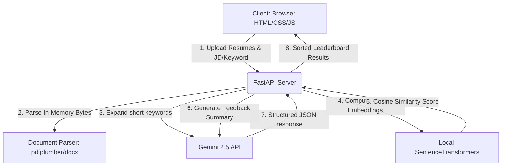

# HireIntel 🎯
### Next-Generation Semantic Resume Matcher & RAG Diagnostics

HireIntel is a modern, high-performance Applicant Tracking System (ATS) utility designed for HR teams. It replaces simple, rigid keyword-matching with deep semantic matching powered by local Machine Learning models, and layers generative AI on top to provide detailed feedback, strengths/gaps analysis, and candidate optimization recommendations.

---

## 🚀 Key Features

* **Local Semantic Scoring (Free & Private):** Uses a local `SentenceTransformers` model (`all-MiniLM-L6-v2`) to translate resumes and job descriptions into high-dimensional vectors, scoring their conceptual alignment using Cosine Similarity.
* **Generative RAG Diagnostics:** Leverages the `Gemini 2.5 Flash` API to write structured, recruiter-grade candidate analyses, including key strengths, missing requirements (gaps), and improvement recommendations.
* **Automated Job Criteria Expansion:** Type in shorthand titles like "SDE II" or "React Dev", and the system automatically synthesizes a full, industry-standard Job Description using AI before matching.
* **Zero-Persistence Parsing:** Extract text in-memory from PDF and DOCX documents using `pdfplumber` and `python-docx` without writing raw resumes to disk (GDPR & data privacy compliant).
* **Asynchronous Concurrency:** Implements parallel execution (`asyncio.gather`) to request AI analyses for multiple candidates at the same time—reducing batch processing times to 2-3 seconds.
* **Premium Editorial Dashboard:** A highly polished, light-themed responsive interface featuring dynamic loading skeletons, custom file dropzones, and collapsible raw-text inspector panels.

---

## 🛠️ Tech Stack

* **Frontend:** Vanilla HTML5, CSS3 (Editorial variables, glassmorphism, responsive grid), JavaScript (State management, async fetch).
* **Backend:** FastAPI (Python web framework), Uvicorn (ASGI web server).
* **AI/ML:** HuggingFace `SentenceTransformers` (`all-MiniLM-L6-v2` local model), Google Gemini API (`gemini-2.5-flash` for structured JSON output).
* **Document Handling:** `pdfplumber` (layout-aware PDF parsing), `python-docx` (Word paragraph & table parser).

---

## 📐 System Architecture



---

## ⚙️ Setup & Installation

### Prerequisites
* Python 3.10 or higher installed on your system.
* A free Gemini API Key (obtained from [Google AI Studio](https://aistudio.google.com/)).

### 1. Clone & Navigate
```bash
git clone https://github.com/ShreyasHegde0105/HireIntel.git
cd HireIntel
```

### 2. Configure Environment Variables
Create a file named `.env` in the root of the project:
```env
GEMINI_API_KEY=your_actual_gemini_api_key_here
PORT=8000
HOST=127.0.0.1
```

### 3. Create & Activate Virtual Environment
```bash
# Windows
python -m venv venv
.\venv\Scripts\Activate.ps1

# macOS/Linux
python3 -m venv venv
source venv/bin/activate
```

### 4. Install Dependencies
```bash
pip install -r requirements.txt
```

### 5. Launch the Backend Server
```bash
uvicorn app.main:app --reload
```
The server will start on `http://127.0.0.1:8000`. You can visit `http://127.0.0.1:8000/docs` to view the interactive API swagger documentation.

### 6. Run the Frontend
Because CORS is configured to allow local file origins, simply double-click `frontend/index.html` to open the HireIntel dashboard in your web browser.

---

## 🔒 Security & Compliance
* **PII Protection:** Resumes are parsed using temporary binary memory streams (`io.BytesIO`) and are never written to disk or database tables.
* **Encrypted API Keys:** The backend retrieves keys via environment files (`.env`), which are excluded from Git tracking via `.gitignore`.
