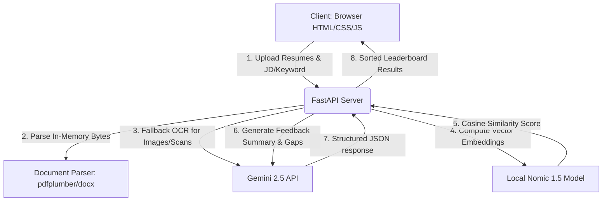

# HireIntel 🎯
### Next-Generation Semantic Resume Matcher & RAG Diagnostics

HireIntel is a modern, high-performance Applicant Tracking System (ATS) utility designed for HR teams. It replaces simple, rigid keyword-matching with deep semantic matching powered by local Machine Learning models, and layers generative AI on top to provide detailed feedback, strengths/gaps analysis, and candidate optimization recommendations.

---

## 📋 Problem Statement

Traditional Applicant Tracking Systems (ATS) suffer from several critical limitations:
1. **Rigid Keyword Matching:** Qualified candidates are routinely filtered out simply because their resumes use synonyms or different phrasing (e.g., "Python Developer" vs. "Backend Software Engineer").
2. **Context Truncation:** Most standard embedding models (like `all-MiniLM-L6-v2`) have a 512-token limit (approx. 350 words). Long, detailed resumes are silently cut off, losing critical experience and achievements from earlier years.
3. **Lack of Qualitative Feedback:** Recruiter dashboards provide a single arbitrary percentage score without explaining *why* a candidate is a good fit or identifying specific skill gaps.
4. **Scanned PDF & Image Failures:** Standard text parsers crash or return empty strings when processing scanned documents or image-based resumes.
5. **Static LLM Time Boundaries:** Large Language Models lack an active system clock, causing them to generate false discrepancy reports when analyzing graduation years (e.g., thinking a student who started in 2023 is still in their 2nd year when the current year is 2026).

---

## 💡 The Solution

HireIntel solves these challenges by combining a high-capacity, local semantic embedding pipeline with generative RAG diagnostics:
* **High-Context Local Search:** Leverages `nomic-embed-text-v1.5` to represent entire multi-page resumes and job descriptions as 768-dimensional vectors with an 8,192-token context window.
* **Recruiter-Grade Diagnostics:** Uses Gemini 2.5 Flash to automatically extract structured JSON feedback including candidate summaries, key strengths, critical gaps, and resume optimization tips.
* **Multimodal OCR Fallback:** Automatically detects scanned PDFs or image uploads (PNG, JPG, JPEG, WEBP) and falls back to Gemini's vision capability to run OCR in-memory.
* **Dynamic Time Anchoring:** Automatically injects the server's current calendar year into the LLM context to ensure accurate date math for student graduation and experience timelines.
* **Zero-Persistence Privacy:** Processes documents entirely in-memory using temporary binary streams. No candidate resumes or PII are written to disk or stored.

---

## 📈 Model Comparison & Metrics

By upgrading from the baseline model to Nomic 1.5, we achieved significant improvements in coverage and semantic accuracy:

| Metric | Baseline (`all-MiniLM-L6-v2`) | Upgrade (`nomic-embed-text-v1.5`) | Impact / Benefit |
| :--- | :--- | :--- | :--- |
| **Context Window** | 512 tokens (~350 words) | **8,192 tokens (~6,000 words)** | **16x increase**; processes multi-page resumes without truncation. |
| **Vector Dimensions**| 384 dimensions | **768 dimensions** | **Double the representation capacity** for complex technical skills. |
| **Domain Suitability**| General semantic text | **Search/Document retrieval** | Highly optimized for matching queries (JDs) to documents (Resumes). |
| **Licensing** | Apache 2.0 | **Apache 2.0** | 100% free and compliant for commercial use. |
| **Inference Latency** | < 10ms per resume | **~50ms - 150ms per resume** | Negligible change to user experience (Gemini API remains the main bottleneck). |
| **RAM Footprint** | ~120 MB | **~500 MB** | Lightweight enough to run locally on standard CPUs. |

---

## 🛠️ Tech Stack

* **Frontend:** Vanilla HTML5, CSS3 (Editorial variables, glassmorphism, responsive grid), JavaScript (State management, async fetch).
* **Backend:** FastAPI (Python web framework), Uvicorn (ASGI web server).
* **AI/ML:** HuggingFace `SentenceTransformers` (`nomic-ai/nomic-embed-text-v1.5`), Google Gemini API (`gemini-2.5-flash` for structured JSON output and OCR).
* **Document Handling:** `pdfplumber` (layout-aware PDF parsing), `python-docx` (Word paragraph & table parser), `einops` (tensor math).

---

## 📐 System Architecture



---

## ⚙️ Setup & Installation

### Prerequisites
* Python 3.10 or higher installed.
* A free Gemini API Key (obtained from [Google AI Studio](https://aistudio.google.com/)).

### 1. Clone & Navigate
```bash
git clone https://github.com/ShreyasHegde0105/HireIntel.git
cd HireIntel
```

### 2. Configure Environment Variables
Create a file named `.env` in the root of the project:
```env
GEMINI_API_KEY=your_actual_gemini_api_key_here
PORT=8000
HOST=127.0.0.1
```

### 3. Create & Activate Virtual Environment
```bash
# Windows
python -m venv venv
.\venv\Scripts\Activate.ps1

# macOS/Linux
python3 -m venv venv
source venv/bin/activate
```

### 4. Install Dependencies
```bash
pip install -r requirements.txt
```

---

## 🚀 Project Execution Process

Follow these steps to run the application locally:

### 1. Start the Backend Server
Run the FastAPI app using Uvicorn:
```bash
uvicorn app.main:app --reload
```
*Note: On your very first run or first match, the server will take a few moments to download the `nomic-embed-text-v1.5` model weights (~280 MB) to your local cache.*

The interactive API documentation will be available at [http://127.0.0.1:8000/docs](http://127.0.0.1:8000/docs).

### 2. Run the Frontend Dashboard
Because CORS is configured to allow all origins for development, you can run the client dashboard using one of these options:
* **Option A (Simple):** Double-click `frontend/index.html` to open it directly in your web browser.
* **Option B (Dev Server):** Serve the frontend using a local server utility (e.g., Live Server extension in VS Code, or Python's HTTP server: `python -m http.server 3000` from the `frontend` folder).

### 3. Match Resumes
1. Select/upload multiple resumes (PDF, DOCX, or image formats).
2. Enter a job description (either copy/paste full text, or type in a short role name like "React Native Dev" to auto-expand it).
3. Click **Analyze Candidates** to view the ranked leaderboard, scores, and candidate feedback cards.
